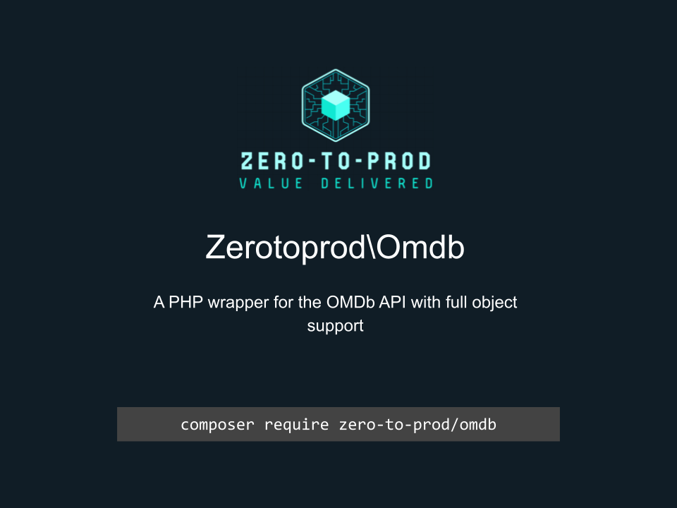

# Zerotoprod\Omdb



[](https://github.com/zero-to-prod/omdb)
[](https://github.com/zero-to-prod/omdb/actions)
[](https://packagist.org/packages/zero-to-prod/omdb/stats)
[](https://packagist.org/packages/zero-to-prod/omdb)
[](https://github.com/zero-to-prod/omdb/blob/main/LICENSE.md)
[](https://wakatime.com/badge/github/zero-to-prod/omdb)
[](https://hitsofcode.com/github/zero-to-prod/omdb/view?branch=main)

## Contents

- [Introduction](#introduction)
- [TLDR](#tldr)
- [Requirements](#requirements)
    - [Getting an OMDb API Key](#getting-an-omdb-api-key)
- [Installation](#installation)
- [Usage](#usage)
    - [poster()](#poster)
    - [byIdOrTitle()](#byidortitle)
    - [search()](#search)
- [Testing](#testing)
    - [Factories](#factories)
    - [Mocking](#mocking)
- [Contributing](#contributing)

## Introduction

`Zerotoprod\OmdbApi` is a PHP cURL wrapper for the [OMDb API](https://www.omdbapi.com/) with full object support.
It allows you to search for movies, series, and other media, retrieve detailed information using IMDb IDs or titles, and fetch poster images.

It wraps the [OmdbApi](https://github.com/zero-to-prod/omdb-api) and returns fully hydrated models using the
[OmdbModels](https://github.com/zero-to-prod/omdb-models) package.

## TLDR

```php
use Zerotoprod\Omdb\Omdb;

$Omdb = Omdb::from('apiKey');

// Get the poster art of a title by its ImdbID
$Omdb->poster('tt0499549'); // https://img.omdbapi.com/?apikey=8f8423aa&i=tt0499549

// Find a title by ImdbID (Internet Movie DataBase ID) or title
$Omdb->byIdOrTitle('Avatar')->Title; // 2009

// Find multiple titles
$Omdb->search('Avatar')->Search['tt0499549']->Year; // 2009
```

## Requirements

- PHP 8.1 or higher.
- cURL extension enabled (typically enabled by default in most PHP installations).
- A valid [OMDb API key](https://www.omdbapi.com/apikey.aspx). A free key is typically available.

### Getting an OMDb API Key

1. Go to the [OMDb API website](https://www.omdbapi.com/apikey.aspx).
2. Sign up for a free or paid plan depending on your usage requirements.
3. After registering, you will receive an API Key that you must pass to the OmdbApi class during initialization.

## Installation

Install `Zerotoprod\Omdb` via [Composer](https://getcomposer.org/):

```shell
composer require zero-to-prod/omdb
```

This will add the package to your project’s dependencies and create an autoloader entry for it.

## Usage

Initialization:

```php
use Zerotoprod\Omdb\Omdb;

$Omdb = Omdb::from('apiKey');
```

You can also customize the base URL and the poster URL if you need to (for example, to proxy through another service):

```php
use Zerotoprod\Omdb\Omdb;

$Omdb = Omdb::from(
    apikey: 'apiKey',
    base_url: 'https://www.omdbapi.com/',
    img_url: 'https://img.omdbapi.com/'
);
```

### poster()

Get the poster art of a title by its ImdbID

```php
$Omdb->poster('tt0499549'); // https://img.omdbapi.com/?apikey=8f8423aa&i=tt0499549
```

### byIdOrTitle()

Find a title by ImdbID (Internet Movie DataBase ID) or title.

Returns a [Title DataModel](https://github.com/zero-to-prod/omdb-models/blob/main/src/Title.php).

```php
$Omdb->byIdOrTitle('Avatar')->Title; // 2009
```

### search()

Find multiple titles. Note the `imdbID` value is used as the key for each movie.

Returns a [SearchResults DataModel](https://github.com/zero-to-prod/omdb-models/blob/main/src/SearchResults.php).

```php
$Omdb->search('Avatar')->Search['tt0499549']->Year; // 2009
```

## Testing

This package uses [PHPUnit](https://phpunit.de/) for testing.
Run the tests locally:

```shell
./vendor/bin/phpunit
```

Ensure you have installed all the development dependencies (composer install) before running the tests.

### Factories

You can use the [provided factories](https://github.com/zero-to-prod/omdb-models#factories) without going through the api like this:

```php
\Zerotoprod\OmdbModels\Factories\TitleFactory::factory()->setTitle('Avatar')->make();
```

### Mocking

You can mock the api by implementing
the [Zerotoprod\OmdbApi\OmdbApiInterface](https://github.com/zero-to-prod/omdb-api/blob/main/src/OmdbApiInterface.php):

```php
use Zerotoprod\OmdbApi\OmdbApiInterface;
use Zerotoprod\Omdb\Omdb;

class OmdbApiFake implements OmdbApiInterface
{
    public function search()
}

$Omdb = new Omdb(new OmdbApiFake());

$Omdb->search('Avatar');
```

## Contributing

Contributions, issues, and feature requests are welcome!
Feel free to check the [issues](https://github.com/zero-to-prod/omdb/issues) page if you want to contribute.

1. Fork the repository.
2. Create a new branch (`git checkout -b feature-branch`).
3. Commit changes (`git commit -m 'Add some feature'`).
4. Push to the branch (`git push origin feature-branch`).
5. Create a new Pull Request.